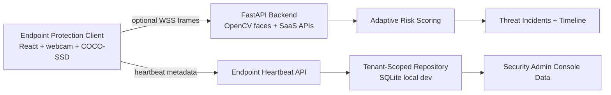
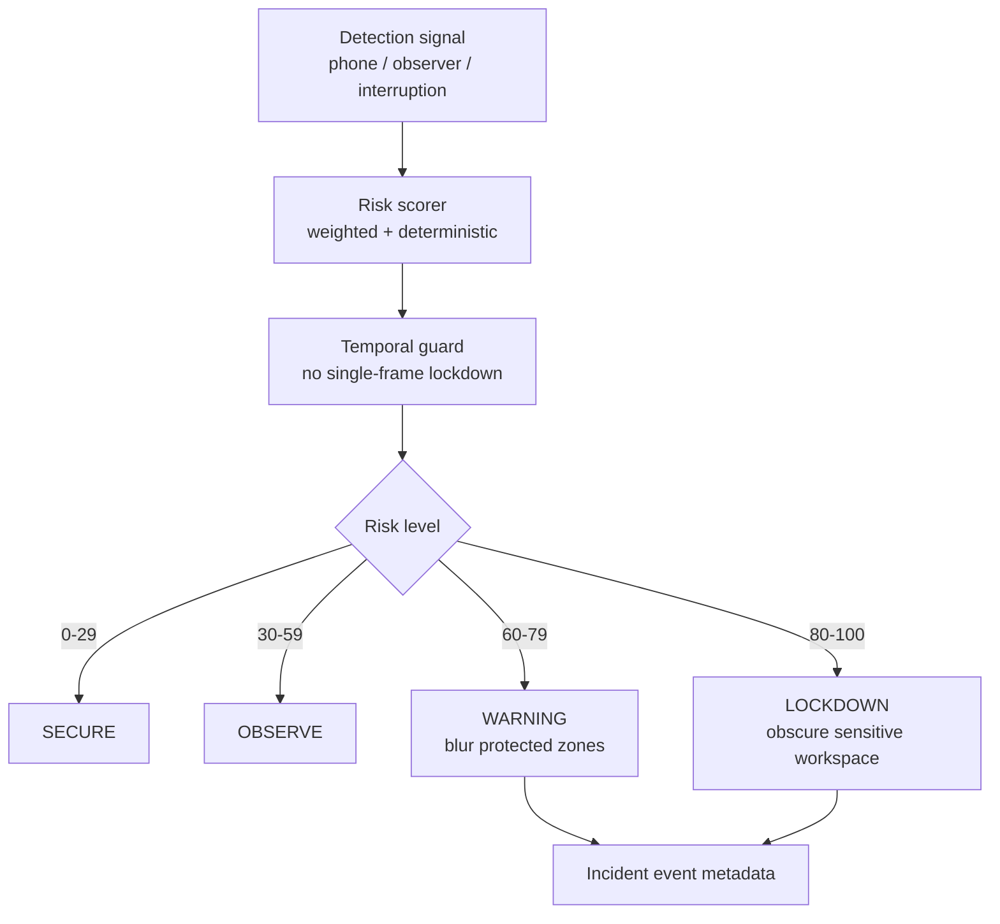
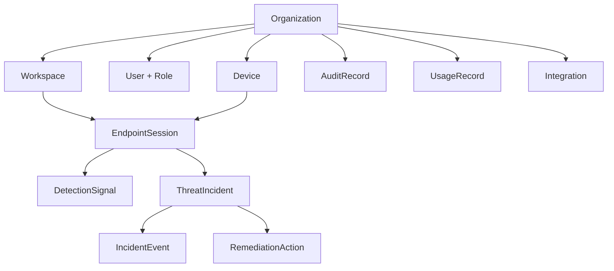
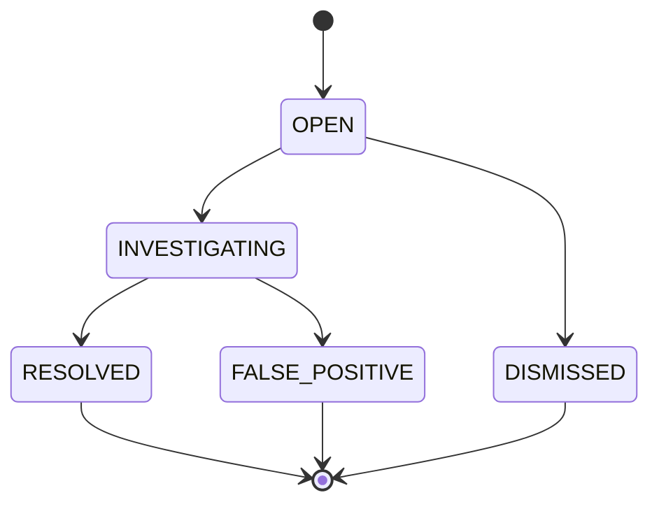

# GlassWall AI

**Real-Time Optical Data Loss Prevention**

[Live app](https://aalimbaba.github.io/GlassWall-AI/) · [Repository](https://github.com/AalimBaba/GlassWall-AI)

GlassWall AI protects sensitive dashboard content when an actual webcam frame contains a persistent smartphone or when a second face remains visible. It combines browser-side TensorFlow.js COCO-SSD phone detection with an optional local FastAPI/OpenCV face-counting backend. Warning, Lockdown, Recovery, and audit events are driven by real model output or clearly labeled manual simulation—never random values or hardcoded camera events.

## Deployment reality

- **GitHub Pages:** runs the full React UI, webcam preview, real browser-side phone inference, phone bounding boxes, temporal phone validation, DLP blur/lockdown, recovery, audit log, and manual simulation.
- **Local full system:** adds FastAPI WebSocket frame processing and OpenCV second-face detection.
- GitHub Pages cannot host Python. On the live site, phone protection works independently while face protection is labeled offline/degraded unless a compatible secure backend is configured.

## Real detection models

### Phone detection

- Model: TensorFlow.js COCO-SSD 2.2.3 with the MobileNet-v2 base.
- Inference: browser-side on actual `HTMLVideoElement` frames.
- Accepted classes: `cell phone`, `smartphone`, `mobile phone`, or `phone` (COCO emits `cell phone`).
- Threshold: 0.45, configurable in `src/phoneThreatTracker.ts`.
- Output: real model confidence and bounding box rendered over the mirrored camera preview.
- Model states: MODEL LOADING, MODEL READY, and MODEL ERROR. Camera start is disabled until the model is ready.

### Face detection

- Model: OpenCV's bundled `haarcascade_frontalface_default.xml`.
- Inference: local Python backend on JPEG frames received over `/ws/analyze`.
- Purpose: count face regions only. There is no identity recognition or biometric enrollment.
- Score: a bounded value derived from the cascade's real level weight; it is not a calibrated identity probability.

## Threat policy

The phone tracker requires three consecutive qualifying frames before starting its duration clock.

| Evidence | Duration | State / response |
| --- | ---: | --- |
| No confirmed threat | — | Secure |
| Phone ≥45%, fewer than 3 frames | — | Secure |
| Phone ≥45%, 3 frames confirmed | Under 1.5 s | Suspicious; no blur yet |
| Confirmed phone | 1.5–3.0 s | Warning; partial dashboard blur |
| Confirmed phone | At least 3.0 s | Lockdown; sensitive dashboard covered |
| Phone removed after protection | Under 2.0 s clear | Recovery; protection remains active |
| Phone removed | At least 2.0 s clear | Secure |
| More than one face | 1.5–3.0 s | Warning |
| More than one face | At least 3.0 s | Lockdown |
| Reset | Immediate | Secure; temporal buffers cleared |

The UI records metadata-only events with timestamp, transition, threat type, actual confidence, duration/state context, and response. Frames are not stored.

## Operational truth states

- MODEL LOADING
- PROTECTION ACTIVE
- DEGRADED PROTECTION
- MODEL ERROR
- CAMERA OFFLINE
- BACKEND OFFLINE (shown in runtime status)

The threat state (`SECURE`, `WARNING`, `LOCKDOWN`) is displayed separately from operational readiness. For example, camera-offline cannot masquerade as fully protected merely because no threat has been observed.

## Architecture

```text
Webcam video
  ├─→ COCO-SSD MobileNet-v2 in browser
  │     → real phone boxes/confidence
  │     → consecutive-frame + duration tracker
  │     → Warning / Lockdown / Recovery
  │
  └─→ hidden canvas JPEG every 400 ms (local full system)
        → FastAPI WebSocket /ws/analyze
        → OpenCV Haar face count
        → backend temporal policy
        → Warning / Lockdown

Combined strongest state
  → partial blur / full protection overlay
  → runtime detections + metadata audit log
```





## SaaS control-plane slice

The backend now includes the first multi-tenant SaaS foundation:

- tenant-aware domain records for organizations, workspaces, users, roles, devices, endpoint sessions, policies, protected zones, detection signals, incidents, incident events, remediation actions, audit records, plans, usage records, and integrations;
- a SQLite/SQLAlchemy repository boundary that can be replaced later by PostgreSQL or Cosmos-backed repositories without moving business rules into route handlers;
- explicit tenant-scope checks for workspaces, devices, endpoint sessions, incidents, and incident events;
- endpoint heartbeat storage with health states: Online, Degraded, Monitoring Interrupted, and Offline;
- heartbeat expiry so endpoints do not stay online forever;
- admin overview data derived from stored endpoint and incident records, with `sample_data: false` unless explicitly seeded in a future demo workspace;
- deterministic adaptive risk scoring with explainable factor contributions, configurable weights, decay, hysteresis, and a guard against single-frame Lockdown.





Relevant files:

```text
src/App.tsx                         Webcam, COCO inference, WebSocket, UI response
src/phoneThreatTracker.ts          Configurable phone temporal state machine
src/phoneThreatTracker.test.ts     One-frame, escalation, recovery, reset tests
backend/app/main.py                FastAPI health and WebSocket API
backend/app/detector.py            Real OpenCV image decoding and face detection
backend/app/threat_engine.py       Face/phone backend temporal policy
backend/app/schemas.py             Typed response contract
backend/app/risk_engine.py         Deterministic adaptive risk scoring
backend/app/saas_models.py         Tenant-aware SaaS domain model
backend/app/saas_repository.py     SQLite/SQLAlchemy tenant repository
backend/tests/                     API and backend state tests
.github/workflows/deploy.yml       GitHub Pages deployment
```

## Run the live/browser system

Requirements: Node.js 20+ and a webcam.

```bash
npm install
npm run dev
```

Open the Vite URL, wait for **MODEL READY**, choose Real Camera Mode, press **Start real camera**, and grant camera permission. Phone detection works without Python.

## Run the full local system

Requirements: Python 3.11+.

```bash
python -m pip install -r backend/requirements.txt
python -m uvicorn backend.app.main:app --host 127.0.0.1 --port 8000 --reload
```

In a second terminal:

```bash
npm run dev
```

In development, the frontend defaults to `ws://127.0.0.1:8000/ws/analyze`. In production, no insecure localhost WebSocket is bundled. Set `VITE_BACKEND_WS_URL=wss://<hosted-backend>/ws/analyze` when a hosted backend exists. Without that variable, the Pages app reports the face backend as unavailable while browser-side phone protection continues working.

Health endpoint: [http://127.0.0.1:8000/health](http://127.0.0.1:8000/health).

Initial SaaS APIs:

- `POST /api/organizations/{organization_id}/heartbeats`
- `GET /api/organizations/{organization_id}/admin/overview`

These APIs require pre-existing organization/workspace/device/session records in the repository. Development seeding will be added as an explicit command in a later slice; the backend does not silently create fake tenants or fake endpoint activity.

## Modes

### Real Camera Mode

- Runs actual COCO-SSD phone inference.
- Uses the face backend when connected.
- Never replaces failed inference with simulation.
- Shows model errors and degraded/offline components explicitly.

### Simulation Mode

- Labeled **Simulation Mode — manual triggers only**.
- Manual buttons are disabled outside Simulation Mode.
- Every event begins with `Simulation:` and cannot contaminate real inference state.

## Test commands

```bash
npm run build
npx vitest run
python -m pytest -q backend/tests
python -m pytest -q
```

Automated coverage includes:

- one-frame phone evidence does not alert;
- confidence below 0.45 does not alert;
- three frames begin suspicious tracking;
- 1.5 seconds reaches Warning;
- 3 seconds reaches Lockdown;
- phone removal enters Recovery and requires 2 seconds clear;
- reset clears accumulated phone evidence;
- blank real images produce no fabricated backend detections;
- malformed frames are rejected;
- one face stays Secure;
- second-face Warning and Lockdown transitions work through the WebSocket contract.
- tenant isolation prevents cross-organization workspace, incident, and timeline access;
- endpoint heartbeat health expires to Offline;
- admin overview counts come from stored endpoint and incident records;
- risk scoring is deterministic, explainable, decays over time, uses hysteresis, and blocks single-frame Lockdown.

## Mandatory real-camera test matrix

| Test | Expected |
| --- | --- |
| One person, no phone | One face locally; no phone; Secure |
| One person holding a prominent smartphone | Real phone box → Suspicious → Warning → Lockdown |
| Phone removed | Recovery for 2 seconds → Secure |
| Two people, no phone | Warning after 1.5 seconds; Lockdown after 3 seconds |
| Empty room | No fabricated phone or face detections |
| Random objects | No phone alert unless COCO-SSD returns a qualifying `cell phone` |
| Camera disabled | CAMERA OFFLINE |
| Phone model download fails | MODEL ERROR; camera start disabled |
| Face backend absent | DEGRADED PROTECTION; browser phone protection remains available |

## Known limitations

- COCO-SSD accuracy depends on lighting, camera quality, phone size, occlusion, and pose. It is not guaranteed to recognize every device.
- A 0.45 threshold favors recall for a prominently held phone but can still produce false positives; temporal confirmation reduces—not eliminates—them.
- Haar cascades can miss profiles, partially covered faces, or poor lighting.
- The live Pages app has no deployed Python face backend. Deploying FastAPI behind HTTPS/WSS is a separate infrastructure step.
- This is a portfolio prototype, not a certified or production-ready DLP control.

## Privacy

COCO-SSD processes video frames in the browser. When the optional local backend is connected, downscaled JPEGs are sent only to the configured WebSocket. The provided backend processes them in memory and stores no images, biometric templates, or identities. Audit events contain metadata only.

## CV Project Description

**GlassWall AI — Real-Time Optical DLP Security Prototype**

- Built a real-time optical DLP prototype using browser-side COCO-SSD smartphone detection, actual bounding boxes, confidence thresholds, and temporal Warning/Lockdown/Recovery controls.
- Integrated React webcam capture with a FastAPI WebSocket and OpenCV face-counting pipeline for persistent second-observer protection without face recognition.
- Implemented operational health states, metadata-only security audits, responsive UI protection, automated tests, and GitHub Pages deployment with honest degraded-mode reporting.

Short version:

> GlassWall AI — real-time optical DLP prototype using COCO-SSD phone detection, OpenCV face counting, temporal validation, and automatic sensitive-UI protection.
